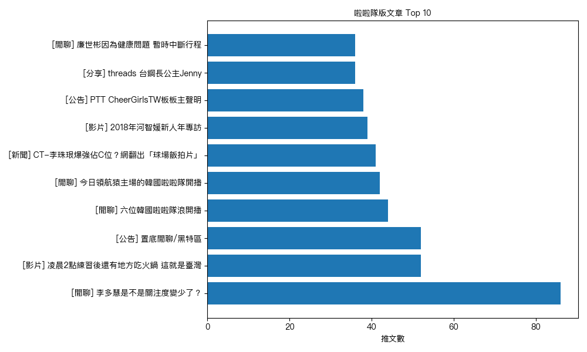

# PTT CheerGirlsTW 熱門文章爬蟲與關鍵字分析

這是一個用 Python 撰寫的爬蟲與分析專案，針對 PTT 批踢踢的《CheerGirlsTW 啦啦隊》看板，擷取文章標題、作者、推文數等資訊，並進行關鍵字分析與視覺化呈現（詞雲與推文排行榜）。

## 📌 功能介紹

1. **爬蟲功能**
   - 自動繞過 PTT 的年齡驗證。
   - 取得 CheerGirlsTW 看板的最新頁碼。
   - 擷取指定頁數的文章資訊（標題、作者、推文數、連結）。
   - 將結果儲存為 CSV。

2. **關鍵字分析**
   - 使用 `jieba` 對標題進行斷詞。
   - 過濾常見停用詞。
   - 統計出現頻率最高的詞語。

3. **視覺化**
   - 利用 `WordCloud` 產生詞雲圖。
   - 使用 `matplotlib` 畫出 Top 10 推文數的長條圖。

## 🧰 使用套件

- requests
- BeautifulSoup (bs4)
- pandas
- jieba
- matplotlib
- wordcloud
- font-manager（處理中文字體）

## 🚀 使用方式

1. **安裝套件**（建議使用虛擬環境）：

   ```bash
   pip install -r requirements.txt
   ```

2. **放入中文字體檔案**

   將 `PingFang.ttc` 放入專案根目錄或指定位置，確保能順利顯示中文字與圖表不會亂碼。若使用其他字型，請修改 `visualize` 部分的 `font_path`。

3. **執行三個程式檔案**：

   - `ptt_scraper.py`：爬取資料並儲存為 `data/cheergirls_articles_3pages.csv`
   - `keyword_analysis.py`：分析標題詞頻並印出前 20 名
   - `visualize.py`：產生詞雲圖與推文排行榜圖表（儲存於 `data/` 資料夾中）

## 📁 專案結構

```
ptt-crawler-project/
│
├── data/
│   ├── cheergirls_articles_3pages.csv   # 爬取的文章資料
│   ├── wordcloud.png                    # 詞雲圖
│   └── top_push.png                     # 推文前 10 名圖
│
├── ptt_scraper.py                       # PTT 爬蟲程式
├── keyword_analysis.py                  # 標題關鍵字分析
├── visualize.py                         # 圖表視覺化程式
├── PingFang.ttc                         # 中文字型（需自備）
└── README.md                            # 專案說明
```

## 📌 範例輸出

- **詞雲圖（wordcloud.png）**
  
  

- **推文排行榜（top_push.png）**

  
